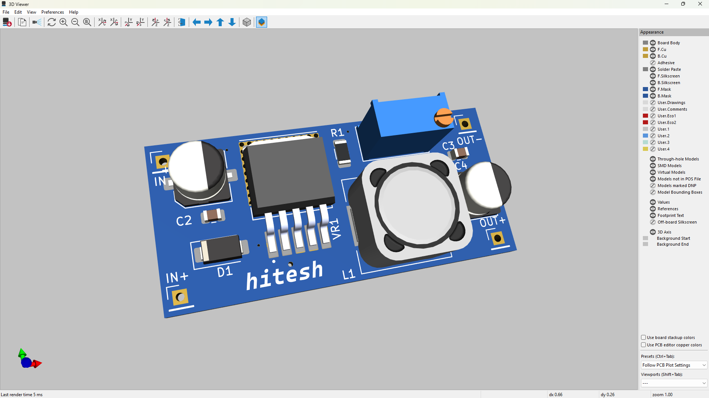
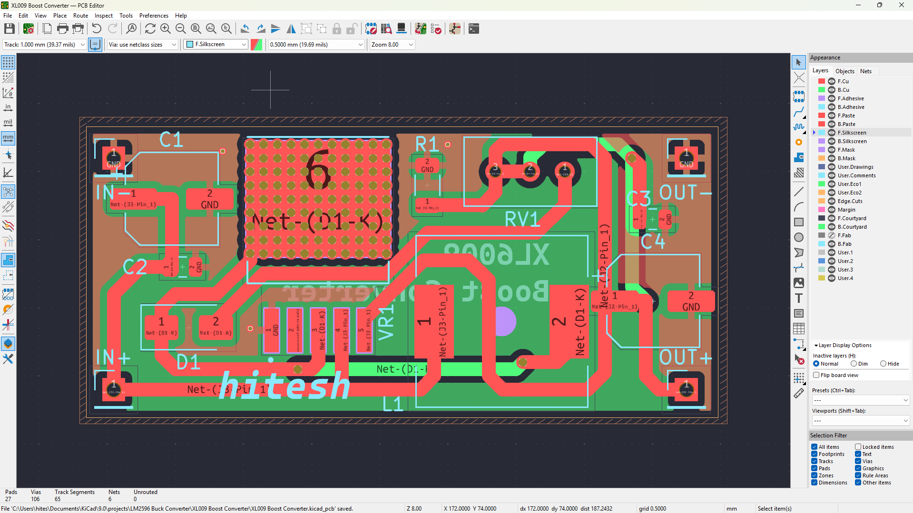
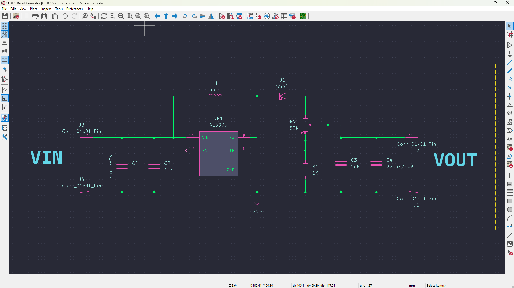

# 🔋 XL6009 Boost Converter – Custom PCB Design

 

## 📘 Project Overview

This is a **custom-designed DC-DC boost converter** PCB built around the **XL6009** switching regulator IC. It’s capable of efficiently stepping up voltage from as low as **5V up to 32V**, delivering up to **4A of output current** with up to **94% efficiency**.

The converter is compact and optimized for applications in **IoT, embedded systems, robotics**, and other projects requiring reliable power delivery.

---

## ⚙️ About the XL6009

The **XL6009** is a monolithic **high-frequency PWM step-up (boost) regulator** from XLSEMI. It’s widely used as a drop-in replacement for the LM2577 but with improved performance and efficiency.

### 🔑 Key Specifications:
- **Input Voltage Range:** 3.6V to 32V  
- **Output Voltage Range:** 5V to 35V (adjustable)  
- **Output Current:** Up to 4A  
- **Switching Frequency:** 400 kHz  
- **Efficiency:** Up to 94%  
- **Integrated MOSFET switch** and internal compensation  
- Built-in soft start and thermal shutdown

---

## ✅ Design Highlights

- 🔧 **Custom 2-layer PCB** designed in **KiCAD**
- 🌀 **Optimized switching loop layout** for reduced EMI and noise
- 🔥 **Thick power traces** and **thermal relief pads** for heat handling
- 🛡️ Full **GND pour** for improved grounding and stability
- 📐 **DRC/ERC clean** and ready for fabrication
- 📦 Includes **BOM, Schematic, and Gerber files**

---

## 📚 What I Learned

Working on this project gave me practical experience in:

- 💡 Designing **switch-mode power supplies (SMPS)**  
- 🧰 Using **KiCAD** for professional PCB design  
- ⚡ Understanding **power trace width, component placement**, and **loop area minimization**  
- 🧠 Making design decisions based on **datasheet parameters** and performance goals  
- 🧪 Preparing a project for real-world fabrication and testing

---

## 🖼️ Gallery

| 3D Render | Layout Snapshot | Schematic Snapshot |
|:-------------:|:---------:|:---------------:|
|  |  |  |

---

## 🛠️ How to Use

1. Connect your input voltage (5V–32V) to the `VIN` and `GND` terminals.
2. Adjust the onboard potentiometer to set your desired output voltage.
3. Measure the output voltage at `VOUT` and `GND`.
4. Use a heatsink if operating at high currents or continuous load.

---
